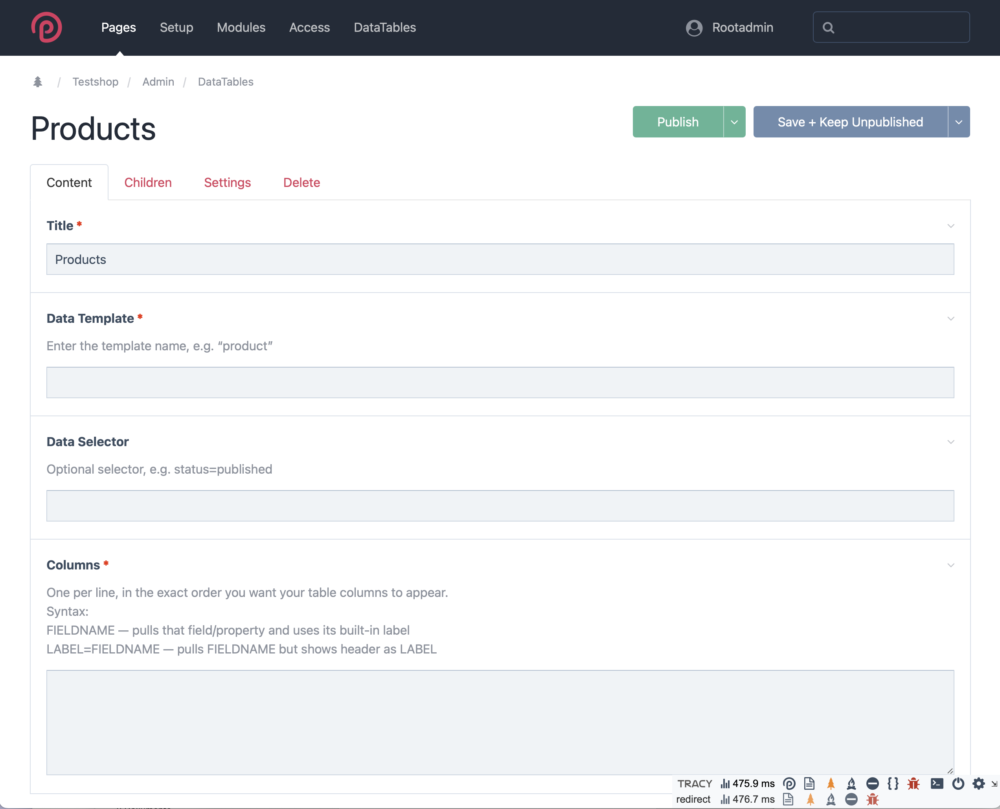

# ProcessDataTables for ProcessWire

**ProcessDataTables** is a flexible ProcessWire admin module that lets you display fully customizable data tables for any template, directly in the backend. Define exactly which fields or properties appear as columns, add per-column output templates, and apply global formatting for a perfect fit to your workflow.

---

## Features

- Create unlimited custom backend tables, each linked to any ProcessWire template
- Pick any fields or page properties as columns, with custom labels and order
- Supports virtual/meta columns for calculated or aggregated data
- Per-column output templates (PHP stubs auto-generated for each column)
- Global formatting options for dates, numbers, images, currencies, checkboxes, and more
- No front-end dependencies—entirely native to ProcessWire admin
- Fast and extensible, built for easy customization

---

## Installation

1. **Copy Files**  
   Clone or download this repository and place the module folder into your `/site/modules/` directory.

2. **Install the Module**  
   - In ProcessWire Admin, go to **Modules > Refresh**.
   - Find **ProcessDataTables** in the list and click **Install**.
   - A new menu item “DataTables” will appear in your admin.

3. **(Optional) Configure Global Settings**  
   - Go to **Modules > ProcessDataTables Config** for global output options (see below).

---

## Module Configuration

The module provides a global configuration interface where you can set formatting and output rules:


**Options include:**

- **Checkbox Output Labels:** Custom text for Yes/No values.
- **Date Format:** PHP date format string (e.g. `d.m.Y H:i`).
- **Currency Format:** Locale and currency code (e.g. `de_AT:EUR`).
- **Decimals for Numbers:** Number of decimal places to display.
- **Max Image Thumbnail Width:** Default pixel width for images.
- **Option Label Mapping:** Map stored values to output labels.
- **Page Reference Separator:** For fields with multiple page references.
- **Max Length for Text/Textarea Output:** Truncate long strings as needed.
- **Strip HTML from Textarea:** Remove HTML tags if desired.

---

## Creating a DataTable

1. **Go to DataTables in the Admin**  
   (If no tables exist, you’ll see:  
   

2. **Add a New Table**  
   Click **Add one now** and complete the form:

   

   - **Title**: Name for your DataTable instance
   - **Data Template**: The machine name of the ProcessWire template whose pages should be listed (e.g., `product`)
   - **Data Selector**: (Optional) Additional PW selector rules (e.g., `status=published, sort=-created`)
   - **Columns**:  
	 - One per line, using:
	   - `FIELDNAME` — use field/property label
	   - `LABEL=FIELDNAME` — use custom label as header
	 - Example:  
	   ```
	   product_image
	   Product=id
	   Shortcopy=product_description
	   colors=variants
	   ```

3. **Save and View the Table**  
   You’ll now see your custom DataTable in the admin, with sortable columns and all formatting applied:

   

   Advanced: You can create additional tables for other templates, like orders:

   

---

## Customizing Output (Column Templates)

- For each column, a **PHP template stub** is auto-generated (in `/site/modules/ProcessDataTables/column_templates/`).
- To customize output, edit the corresponding `.column.php` file for your column.
- These templates have access to the field value (`$value`) and module config variables.
- Example: To display a page reference as a colored badge, or format currency, just adjust the PHP code in that file.

---

## Example Screenshots

### Config Screen


### Add Table


### Edit Table


### Generated Table Output without editing Column Templates


### Orders Output with minor edits of the Column Templates
 

---

## Uninstalling

- When uninstalling the module via admin, all generated column templates and config fields are cleaned up. So maybe keep a backup of the already configured column templates and table configurations as a backup in a text file. For example:
```
Products
--
product
--
product_image
Product=id
Shortcopy=product_description
rockcommerce_net
colors=variants
```

---

## Notes

- Column template stubs are only generated if they do not already exist. Delete a stub to force regeneration.
- This module does not touch your frontend. All customization is in the admin.

---

## License

MIT. Use and modify freely.

---

## Credits

Developed by [frameless Media](https://framelessmedia.at/)

---
