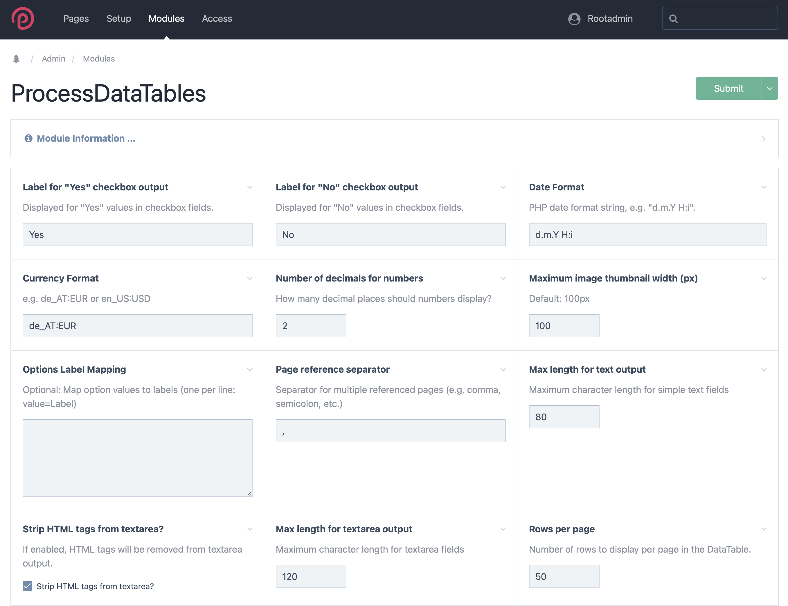
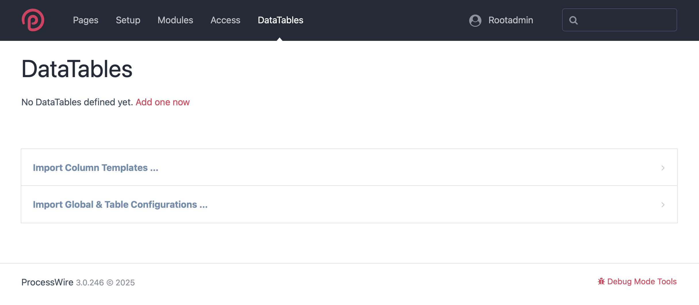
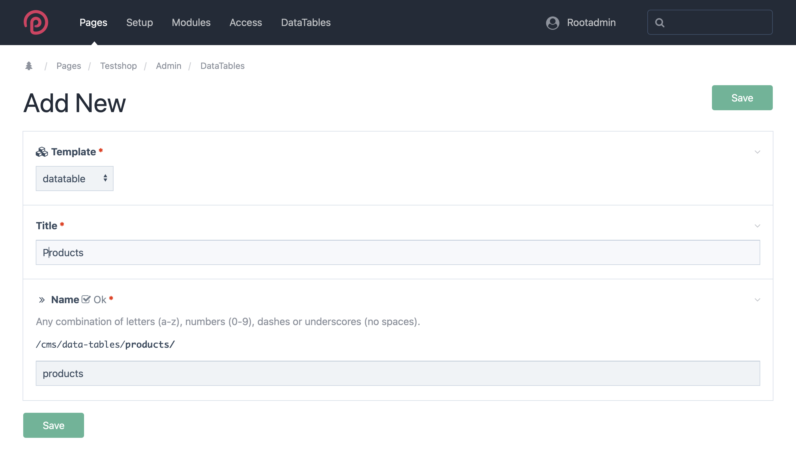
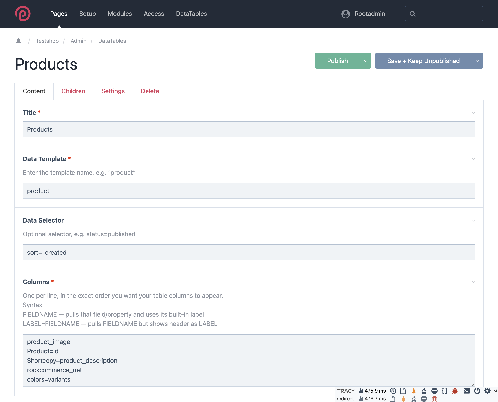
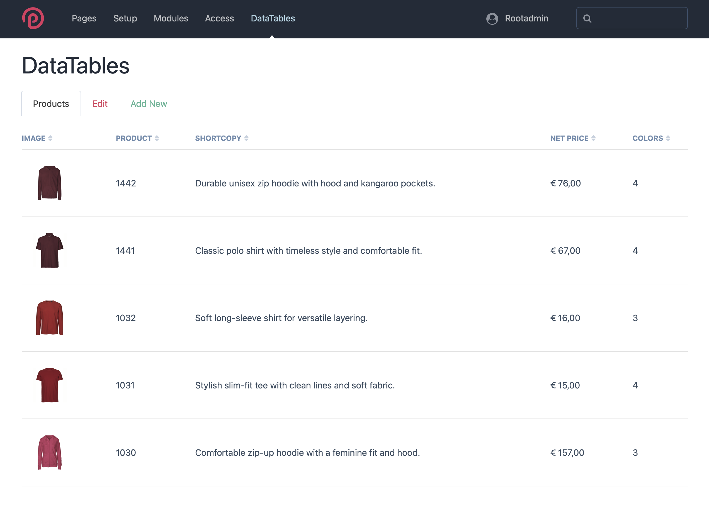
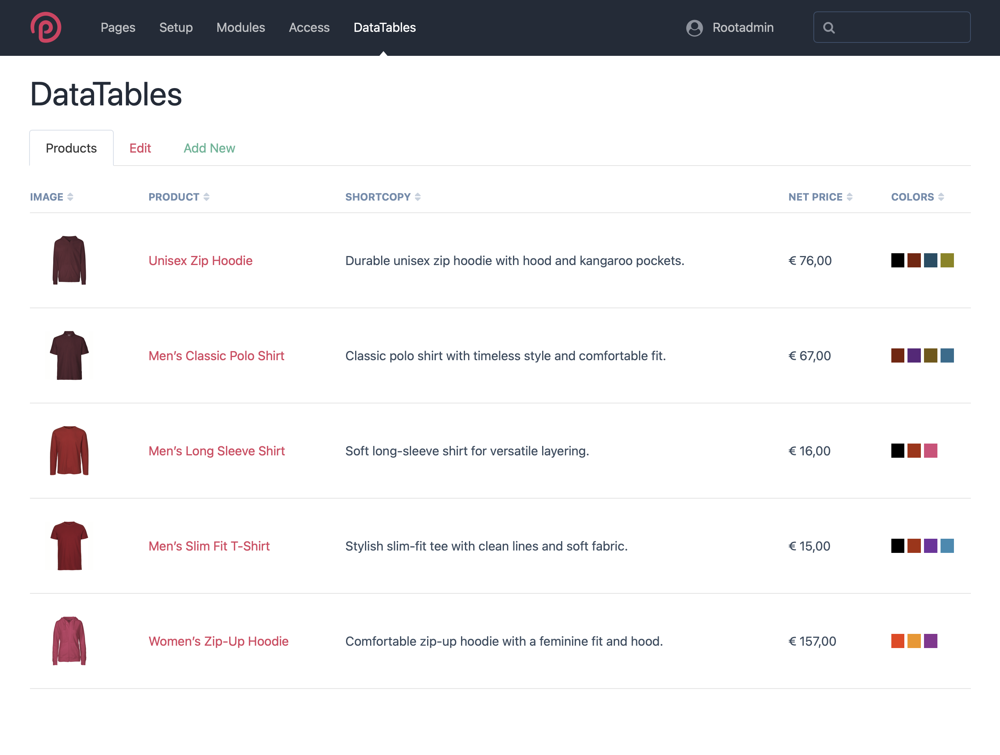
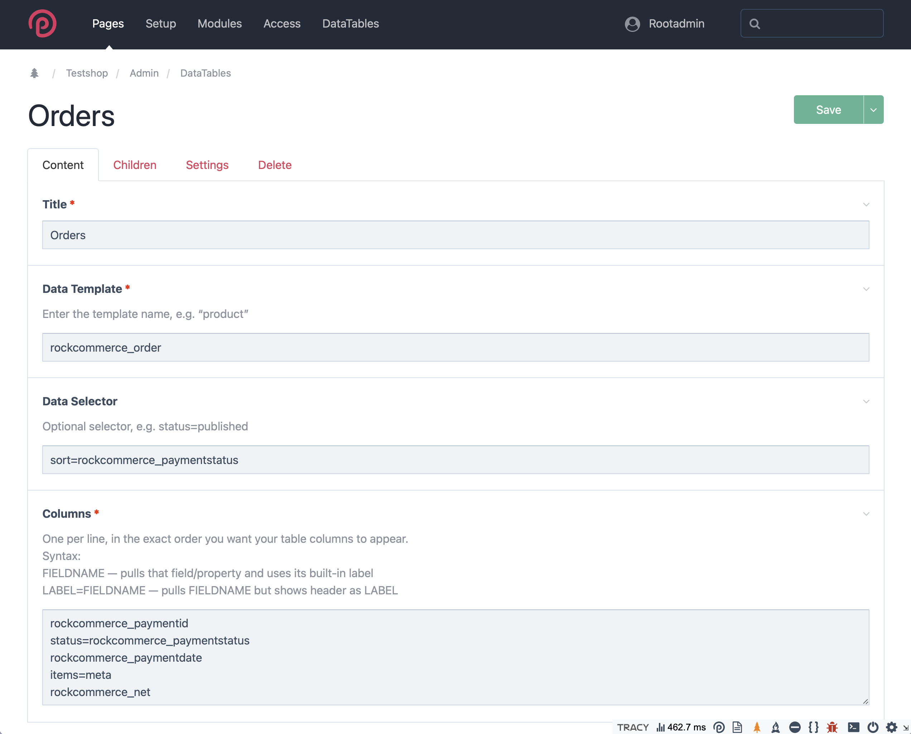
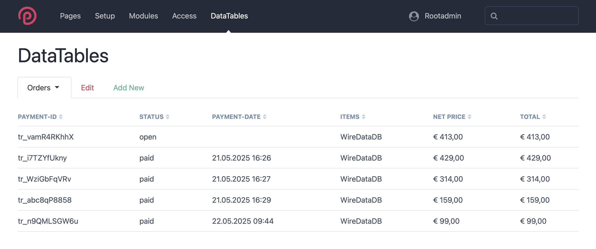
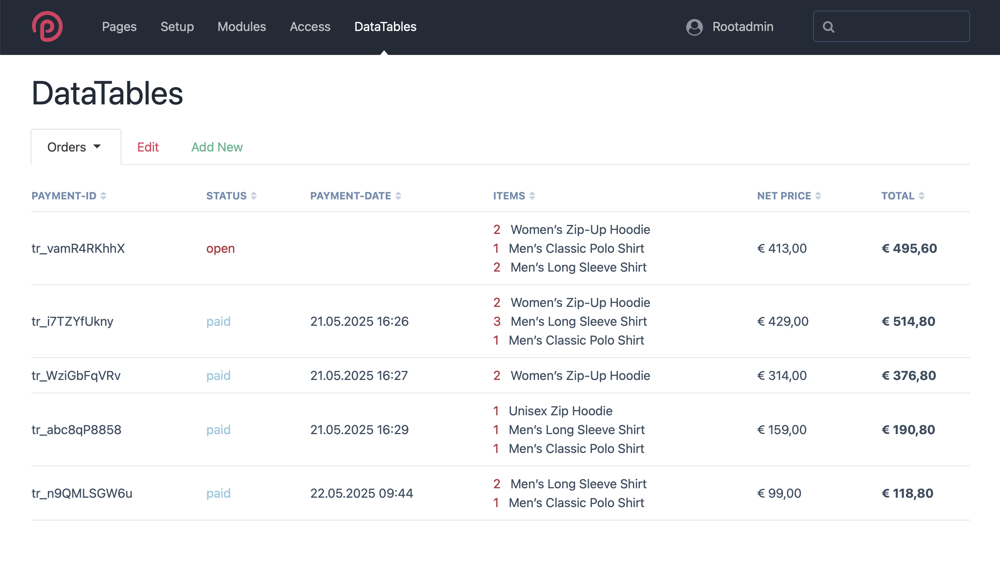

# The Swiss Army Knife for Data Visualization 

**ProcessDataTables** is a flexible ProcessWire admin module that lets you display fully customizable data tables for any template, directly in the backend. Define exactly which fields or properties appear as columns, add per-column output templates, and apply global formatting for a perfect fit to your workflow.

---

## Features

- Create unlimited custom backend tables, each linked to any ProcessWire template
- Pick any fields or page properties as columns, with custom labels and order
- Supports virtual/meta columns for calculated or aggregated data
- Per-column output templates (PHP stubs auto-generated for each column)
- Global formatting options for dates, numbers, images, currencies, checkboxes, and more
- No front-end dependencies—entirely native to ProcessWire admin
- Fast and extensible, built for easy customization


---


## Installation

1. **Copy Files**  
   Clone or download this repository and place the module folder into your `/site/modules/` directory.

2. **Install the Module**  
   A new menu item “DataTables” will appear in your admin under /admin/setup/.

3. **Configure Global Settings (Optional)**  
   Customize global output options to your needs (see below).


---


## Module Configuration

The module provides a global configuration interface where you can set formatting and output rules:



**Options include:**

- **Checkbox Output Labels:** Custom text for Yes/No values.
- **Date Format:** PHP date format string (e.g. `d.m.Y H:i`).
- **Currency Format:** Locale and currency code (e.g. `de_AT:EUR`).
- **Decimals for Numbers:** Number of decimal places to display.
- **Max Image Thumbnail Width:** Default pixel width for images.
- **Option Label Mapping:** Map stored values to output labels.
- **Page Reference Separator:** For fields with multiple page references.
- **Max Length for Text/Textarea Output:** Truncate long strings as needed.
- **Strip HTML from Textarea:** Remove HTML tags if desired.


---

## New: Import/Export Configuration and Templates

**Since v0.6.0**  
You can now export and import the module configuration and all DataTable definitions as JSON, as well as all column templates as a ZIP archive.

- **Export Configuration:**  
  Use the **Export Config** button to download the current module configuration and DataTable settings as a JSON file.
- **Import Configuration:**  
  Use **Import Config** to load a previously exported JSON and restore your tables/settings.
- **Export/Import Templates:**  
  Use **Export Templates** and **Import Templates** to batch-transfer all column template files (as a ZIP archive) between installations.

> **Note:** This makes migration, backup, and setup on new ProcessWire sites much easier.

---

## Creating a DataTable

1. **Go to DataTables in the Admin**  
   The path where its displayed is up to you, per default it is located in /admin/setup/. If no tables exist, you’ll see:
   
   

3. **Add a New Table**  
   Click **Add one now** and complete the forms:

   

   

   - **Title**: Name for your DataTable instance
   - **Data Template**: The machine name of the ProcessWire template whose pages should be listed (e.g., `product`)
   - **Data Selector**: (Optional) Additional PW selector rules (e.g., `status=published, sort=-created`)
   - **Columns**:  
	 - One per line, using:
	   - `FIELDNAME` — use field/property label
	   - `LABEL=FIELDNAME` — use custom label as header
	 - Example:  
	   ```
	   product_image
	   Product=id
	   Shortcopy=product_description
	   colors=variants
	   ```
   - **Supported Page Properties as Columns** You may use any ProcessWire page property (e.g. `id`, `name`, `created`, `modified`, `status, `parent`, `url`) as a column. These are handled with unified logic and can be formatted just like custom fields.
  
4. **Save and View the Table**  
   You’ll now see your custom DataTable in the admin, with sortable columns and all default formatting (depending on fieldtypes) applied:




---


## Customizing Output (Column Templates)

- For each column, a **PHP template stub** is auto-generated (in `/site/assets/ProcessDataTables/column_templates/`).
  The stubs are generated depending on the ProcessWire FieldType of the templates field you defined as a column.
  
  **Since v0.5.0**  
  Column template stubs are organized in subfolders under `/site/assets/ProcessDataTables/column_templates/{datatable_name}/`.  
  Each DataTable has its own subfolder for its templates. The stub file name is based on the column name.
  
  **Example:**  
  `/site/assets/ProcessDataTables/column_templates/products/price.column.php`
  
  - To customize output for a column, edit the relevant file in its DataTable’s subfolder.
  - Delete a stub to force regeneration with the next save.
  
  > **Upgrade Note:** Export and delete any old sub files directly under `column_templates/` before upgrading to avoid conflicts.
  
  All provided fieldtype templates are inline PHP return functions. Simply edit the relevant .column.php stub to customize the output for any field, and return the desired value or markup.
  
  ---
  Example of the stub created for `colors=variants`:
```
<?php
/**
* Output template for field: variants
* Column label: colors
* Fieldtype: FieldtypeRepeater
* Available variable: $value
*/
return function($value, $config = []) {
  return $value->count();
};
```

- To customize output, edit the corresponding `.column.php` file for your column.
- These templates have access to the field value (`$value`) and module config variables.
- To display the `color`value of the FieldtypeRepeater entries as colored badges, just adjust the PHP code in that file above to something like:
 ```
<?php
/**
* Output template for field: variants
* Column label: colors
* Fieldtype: FieldtypeRepeater
* Available variable: $value
*/
return function($value, $config = []) {
  return $value->each("<span style='background-color:{color}; color:#fff'>&nbsp;&nbsp;&nbsp;&nbsp;</span> ");
};
```
Quick and dirty, but it works:




---


## Another example using the incredible module [RockCommerce](https://www.baumrock.com/processwire/module/rockcommerce/) from Bernhard Baumrock

### Config Screen



### Generated Table Output without editing Column Templates



### Orders Output with minor edits of the Column Templates

 


---


## Uninstalling

- When uninstalling the module via admin, all generated column templates and config fields are cleaned up. If you want to keep a Backup, just export your Configurations and column templates.

---

## Notes

- Column template stubs are only generated if they do not already exist. Delete a stub or add/change a column label to force regeneration.
- The default templates from which all column templates are auto created can be found in `/site/modules/ProcessDataTables/fieldtype_templates/`. 
- This module does not touch your frontend. All customization is in the admin.

---

## License

This project is licensed under the terms of the [GNU General Public License v3.0](https://www.gnu.org/licenses/gpl-3.0.html).  
See the [LICENSE](LICENSE) file for details.

---

## Credits

Developed by [frameless Media](https://frameless.at/)

---
